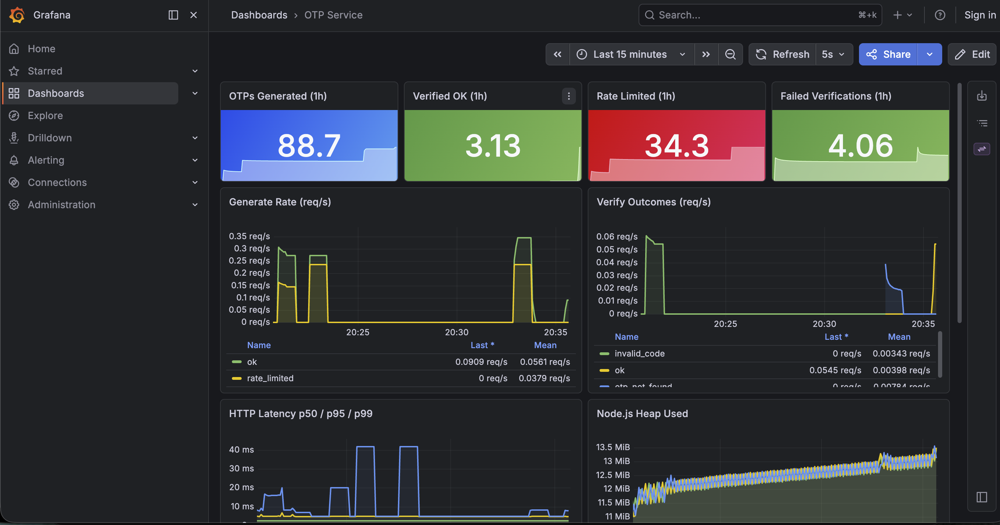
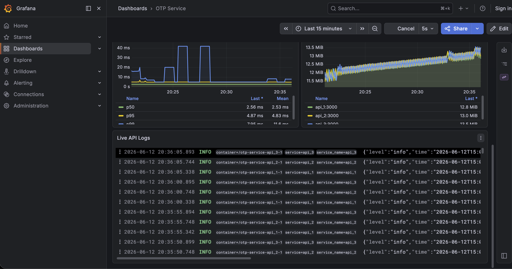

# OTP Service

A distributed OTP (one-time password) generation and verification system. Built as a pnpm monorepo with a focus on correctness under concurrency, multi-window rate limiting, and horizontal scalability.

---

## How This Was Built

This project was built using **spec-driven development**: every phase was fully specified as a written document before a single line of implementation code was written. Implementation strictly followed phase order — no phase started until the previous phase's exit criteria were fully met and ticked off.

| Phase | What it specified | Doc |
|---|---|---|
| 1 | Monorepo scaffold, path alias audit, empty barrels | [`docs/phases/phase-1.md`](docs/phases/phase-1.md) |
| 2 | TypeScript types, constants, Redis key schema — the full vocabulary | [`docs/phases/phase-2.md`](docs/phases/phase-2.md) |
| 3 | Redis client, Lua scripts, OTP engine, rate limiter — all domain logic | [`docs/phases/phase-3.md`](docs/phases/phase-3.md) |
| 4 | Hono HTTP server, routes, Zod validation, error handling | [`docs/phases/phase-4.md`](docs/phases/phase-4.md) |
| 5 | Multi-stage Dockerfile, NGINX config, Docker Compose orchestration | [`docs/phases/phase-5.md`](docs/phases/phase-5.md) |
| 6 | Structured logging, startup validation, graceful shutdown, integration tests | [`docs/phases/phase-6.md`](docs/phases/phase-6.md) |

A Prometheus + Grafana + Loki observability stack was added alongside Phase 6 as an extension beyond the original spec.

---

## What It Does

Two HTTP endpoints:

- `POST /otp/generate` — generates a 6-digit OTP for a given user and stores it in Redis with a 5-minute TTL. Enforces per-user rate limits across three independent time windows before issuing.
- `POST /otp/verify` — validates a submitted code against what's stored in Redis. The code is single-use and expires after 5 failed attempts.

Everything is stateless at the application layer. All OTP state, attempt counts, and rate-limit counters live exclusively in Redis.

---

## Architecture

```
                        Client
                          │
                          ▼
          ┌─────── NGINX :80 ───────┐
          │  Round-robin + IP limit  │
          └──────────┬──────────────┘
                     │
          ┌──────────┼──────────┐
          ▼          ▼          ▼
      api_1:3000  api_2:3000  api_3:3000   (Hono)
          │          │          │
          └──────────┼──────────┘
                     │ shared state
                     ▼
                 Redis :6379
```

```
Observability (runs alongside — does not sit in the request path)

  Prometheus :9090 ──── scrapes GET /metrics on all 3 replicas every 5s
       │
       ▼
  Grafana :3001 ──── queries Prometheus (metrics) + Loki (logs)
       │
  Loki :3100 ◄──── Promtail (Docker socket → parses container stdout → pushes to Loki)
```

Three API replicas run behind NGINX in round-robin. All replicas share the same Redis instance so rate-limit counters and OTP state are consistent regardless of which replica handles a request. Prometheus scrapes each replica's `/metrics` endpoint directly over the Docker internal network — it does not go through NGINX.

---

## Monorepo Structure

```
otp-service/
├── apps/
│   └── api/                        # Hono HTTP server
│       ├── Dockerfile               # Multi-stage build → ~67 MB image
│       └── src/
│           ├── index.ts             # Entrypoint + graceful shutdown (SIGTERM/SIGINT)
│           ├── app.ts               # Hono app factory (used by server + tests)
│           ├── constants.ts         # APP + SERVER env vars
│           ├── metrics.ts           # prom-client counters + histograms
│           ├── startup.ts           # Env validation — fails fast on bad config
│           ├── validation/          # Zod request schemas
│           ├── middleware/
│           │   ├── error-handler.ts # Normalised JSON error envelope
│           │   └── logger.ts        # Request-scoped child logger (requestId)
│           ├── routes/
│           │   ├── otp.ts           # POST /otp/generate  POST /otp/verify
│           │   └── health.ts        # GET /health
│           └── __tests__/
│               └── otp.test.ts      # 12 integration tests (Vitest, real Redis)
├── packages/
│   ├── core/                       # All domain logic
│   │   └── src/
│   │       ├── constants.ts         # REDIS + OTP + RATE_LIMIT env vars
│   │       ├── types.ts             # Domain types + discriminated unions
│   │       ├── redis-keys.ts        # Centralised Redis key factory
│   │       ├── redis/
│   │       │   ├── client.ts        # ioredis singleton with keyPrefix
│   │       │   └── scripts.ts       # Atomic Lua scripts (generate + verify)
│   │       ├── otp/
│   │       │   └── generate.ts      # Pure 6-digit code generator
│   │       └── services/
│   │           ├── generateOtp.ts   # Rate-limit check → write OTP
│   │           └── verifyOtp.ts     # Attempt guard → compare → single-use delete
│   └── logger/                     # Shared pino logger + child logger factory
├── nginx/
│   └── nginx.conf                  # Upstream pool, keepalive, IP-level rate limit
├── observability/
│   ├── prometheus.yml               # Scrape config — all 3 replicas at 5s
│   ├── loki.yml                     # Loki single-process config
│   ├── promtail.yml                 # Docker socket discovery → Loki
│   └── grafana/
│       ├── provisioning/
│       │   ├── datasources/         # Auto-provisions Prometheus + Loki datasources
│       │   └── dashboards/          # Points Grafana at the dashboard JSON
│       └── dashboards/
│           └── otp-service.json     # Pre-built animated dashboard (no setup required)
├── docker-compose.yml               # Full stack — 9 containers, 1 command
├── .env.example                     # All 11 env vars documented with defaults
├── biome.json
├── tsconfig.base.json
└── pnpm-workspace.yaml
```

---

## Quick Start

**Prerequisites:** Docker Desktop

```bash
git clone <repo>
cd otp-service

cp .env.example .env   # defaults work out of the box — no edits needed

docker compose up
```

All 9 containers start in dependency order. Once up:

| Service | URL | Purpose |
|---|---|---|
| API (via NGINX) | `http://localhost` | Send requests here |
| Grafana | `http://localhost:3001` | Live animated dashboard — open this |
| Prometheus | `http://localhost:9090` | Raw metric queries |
| Redis | `localhost:6379` | Exposed for local `redis-cli` debugging |

---

## Observability

### Grafana Dashboard — `http://localhost:3001`

No login required (anonymous admin is pre-configured). The **OTP Service** dashboard loads automatically — no manual setup.





**Panels:**

| Panel | Type | What it shows |
|---|---|---|
| OTPs Generated (1h) | Stat tile | Running total of generate requests in the last hour |
| Verified OK (1h) | Stat tile | Successful verifications in the last hour |
| Rate Limited (1h) | Stat tile | Requests blocked by the per-user rate limiter |
| Failed Verifications (1h) | Stat tile | Wrong code / max attempts / not found |
| Generate Rate | Time series | `ok` vs `rate_limited` requests per second, animated |
| Verify Outcomes | Time series | All verify result types per second |
| HTTP Latency p50/p95/p99 | Time series | Request latency percentiles from the histogram |
| Node.js Heap per replica | Time series | One line per replica — watch all 3 update live |
| Live Logs | Logs panel | Structured JSON log stream from all replicas via Loki |

Dashboard **auto-refreshes every 5 seconds**.

### Generate traffic to see the dashboard animate

```bash
for i in $(seq 1 50); do
  curl -s -o /dev/null -X POST http://localhost/otp/generate \
    -H "Content-Type: application/json" \
    -d "{\"userId\":\"u$((RANDOM % 5))\"}"
done
```

### Metrics endpoint

Each API replica exposes `GET /metrics` in Prometheus text format. Prometheus scrapes all three replicas directly (over the Docker internal network, not through NGINX) every 5 seconds.

| Metric | Type | Labels |
|---|---|---|
| `otp_generate_total` | Counter | `result`: `ok` \| `rate_limited` |
| `otp_verify_total` | Counter | `result`: `ok` \| `invalid_code` \| `not_found` \| `max_attempts` |
| `http_request_duration_seconds` | Histogram | `method`, `path`, `status` |
| `nodejs_heap_size_used_bytes` | Gauge | — (from `collectDefaultMetrics`) |
| + ~10 more default Node.js metrics | — | GC, event loop lag, CPU, handles |

### Structured logs — Loki

Every request log line is emitted as JSON to stdout. Promtail tails the Docker socket, auto-discovers all `otp-service-api_*` containers, and ships the parsed logs to Loki. Grafana queries Loki directly.

Every log line contains:

```json
{
  "level": "info",
  "time": "2026-06-12T14:50:21.403Z",
  "requestId": "3b041ab1-8ce6-4e33-97f0-eb5617c0440e",
  "method": "POST",
  "path": "/otp/generate",
  "status": 200,
  "durationMs": 4,
  "msg": "request"
}
```

`requestId` is taken from the `X-Request-ID` request header if present (e.g. set by NGINX or a client), otherwise generated as a UUID. To trace a single request across replicas in Grafana Explore:

```
{service=~"api_.+"} | json | requestId="3b041ab1-..."
```

---

## Smoke Test

```bash
# 1. Generate an OTP
curl -s -X POST http://localhost/otp/generate \
  -H "Content-Type: application/json" \
  -d '{"userId":"smoketest"}' | jq .
# → { "ok": true, "otpTtlSeconds": 300 }

# 2. Read the code directly from Redis
#    Keys in Redis are prefixed by REDIS_KEY_PREFIX ("otp:") via ioredis keyPrefix.
#    RedisKeys.otpCode("smoketest") = "otp:smoketest:code" → stored as "otp:otp:smoketest:code"
CODE=$(docker exec otp-service-redis-1 redis-cli GET "otp:otp:smoketest:code")
echo "Code: $CODE"

# 3. Verify with the correct code → consumed (single-use)
curl -s -X POST http://localhost/otp/verify \
  -H "Content-Type: application/json" \
  -d "{\"userId\":\"smoketest\",\"code\":\"$CODE\"}" | jq .
# → { "ok": true }

# 4. Replay the same code → rejected
curl -s -X POST http://localhost/otp/verify \
  -H "Content-Type: application/json" \
  -d "{\"userId\":\"smoketest\",\"code\":\"$CODE\"}" | jq .
# → { "ok": false, "code": "OTP_NOT_FOUND" }
```

---

## Development (without Docker)

```bash
pnpm install
pnpm -r build

# Requires Redis on localhost:6379
pnpm --filter @otp-service/api dev
```

---

## Testing

Integration tests run against a real Redis instance. Redis state and Lua script behaviour are not mocked — the tests prove the actual Lua scripts, TTL logic, and attempt counting are correct end-to-end.

```bash
# Redis must be running — either:  docker compose up redis
#                             or:  brew services start redis
pnpm test
```

**12 test cases — all pass:**

| Test | Asserts |
|---|---|
| `GET /health` | `200 { ok: true, uptime: number }` |
| Generate — valid userId | `200 { ok: true, otpTtlSeconds: 300 }` |
| Generate — missing userId | `400 VALIDATION_ERROR` |
| Generate — empty string userId | `400 VALIDATION_ERROR` |
| Generate — 3× succeed, 4th blocked | `429 RATE_LIMITED { window: "minute" }` |
| Verify — correct code | `200 { ok: true }` |
| Verify — wrong code | `422 INVALID_CODE` |
| Verify — unknown userId | `404 OTP_NOT_FOUND` |
| Verify — 5 wrong attempts | `429 MAX_ATTEMPTS_EXCEEDED` |
| Verify — replay after success | `404 OTP_NOT_FOUND` (single-use enforced) |
| Resend — second generate succeeds | `200` on second generate |
| Resend — old code rejected | `422 INVALID_CODE` after resend |

---

## HTTP API Reference

### `POST /otp/generate`

| Field | Type | Constraints |
|---|---|---|
| `userId` | string | 1–128 chars |

```jsonc
// 200 — issued
{ "ok": true, "otpTtlSeconds": 300 }

// 429 — rate limited
{ "ok": false, "code": "RATE_LIMITED", "window": "minute", "retryAfterSeconds": 34 }

// 400 — validation error
{ "ok": false, "code": "VALIDATION_ERROR", "message": "..." }
```

### `POST /otp/verify`

| Field | Type | Constraints |
|---|---|---|
| `userId` | string | 1–128 chars |
| `code` | string | exactly 6 digits |

```jsonc
// 200 — correct, OTP consumed
{ "ok": true }

// 422 — wrong code (attempts still remaining)
{ "ok": false, "code": "INVALID_CODE" }

// 429 — 5 wrong attempts exhausted
{ "ok": false, "code": "MAX_ATTEMPTS_EXCEEDED" }

// 404 — expired, already used, or never existed
{ "ok": false, "code": "OTP_NOT_FOUND" }

// 400 — malformed request
{ "ok": false, "code": "VALIDATION_ERROR", "message": "..." }
```

### `GET /health`

```json
{ "ok": true, "uptime": 42.3 }
```

---

## Rate Limiting

Every generate request checks three independent per-user counters atomically before writing any OTP. All checks and writes happen inside a single Lua script.

| Window | Limit | TTL |
|---|---|---|
| Minute | 3 | 60s |
| Hour | 10 | 1h |
| Day | 20 | 24h |

TTLs are set with `EXPIRE … NX` — pinned to when the **first** request in that window arrived. Subsequent requests within the window do not extend it.

---

## Redis Key Schema

Keys are constructed by `packages/core/src/redis-keys.ts` and then prefixed by ioredis `keyPrefix` (`REDIS_KEY_PREFIX`, default `otp`). The table below shows the **actual key names stored in Redis**.

| Key in Redis | Value | TTL | Purpose |
|---|---|---|---|
| `otp:otp:{userId}:code` | 6-digit string | 5 min | Active OTP |
| `otp:otp:{userId}:attempts` | integer | 5 min | Failed attempt counter |
| `otp:ratelimit:{userId}:minute` | integer | 60s | Minute-window counter |
| `otp:ratelimit:{userId}:hour` | integer | 1h | Hour-window counter |
| `otp:ratelimit:{userId}:day` | integer | 24h | Day-window counter |

The double `otp:otp:` prefix on OTP keys is because `RedisKeys.otpCode()` returns `otp:{userId}:code` and ioredis prepends `otp:` via `keyPrefix`. Rate-limit keys do not have this doubling because `RedisKeys.rateLimit()` returns `ratelimit:{userId}:{window}`.

---

## Concurrency

Multiple API replicas processing requests simultaneously against the same Redis keys would cause race conditions without atomicity guarantees. Both the generate and verify operations are implemented as Lua scripts, which Redis executes as single atomic units — no other command can interleave between the read and write steps.

---

## Environment Variables

Copy `.env.example` to `.env`. All defaults work for local development with no changes.

| Variable | Default | Description |
|---|---|---|
| `NODE_ENV` | `development` | `development` \| `production` |
| `PORT` | `3000` | HTTP server port |
| `HOST` | `0.0.0.0` | HTTP server bind address |
| `REDIS_URL` | `redis://localhost:6379` | Redis connection URL |
| `REDIS_KEY_PREFIX` | `otp` | Namespace prefix applied to all Redis keys by ioredis |
| `OTP_TTL_SECONDS` | `300` | OTP validity window in seconds |
| `OTP_MAX_ATTEMPTS` | `5` | Max failed verify attempts per OTP |
| `RATE_LIMIT_MINUTE` | `3` | Max OTP generations per minute per user |
| `RATE_LIMIT_HOUR` | `10` | Max OTP generations per hour per user |
| `RATE_LIMIT_DAY` | `20` | Max OTP generations per day per user |
| `LOG_LEVEL` | `debug` (dev) / `info` (prod) | Pino log level — auto-derived from `NODE_ENV` if not set |

---

## Tech Stack

| Layer | Choice | Notes |
|---|---|---|
| Language | TypeScript 5 (strict) | ESM, no `function` keyword, `@/` path aliases |
| Runtime | Node.js 22 LTS | |
| HTTP Framework | Hono 4 | Lightweight, first-class TypeScript |
| Redis Client | ioredis 5 | Lua script support, `keyPrefix` namespacing |
| Validation | Zod 3 | Schema-first, type inference |
| Logging | pino | Structured JSON, child loggers with `requestId` |
| Load Balancer | NGINX | Round-robin, keepalive pool, IP-level rate limit |
| Containerisation | Docker + Compose | Multi-stage image, ~67 MB, non-root user |
| **Metrics** | **Prometheus + prom-client** | **Scrapes all 3 replicas every 5s** |
| **Dashboards** | **Grafana** | **Auto-provisioned, 5s live refresh, no login** |
| **Log aggregation** | **Grafana Loki + Promtail** | **Docker socket discovery, JSON log parsing** |
| Linting / Formatting | Biome | Enforces all AGENTS.md style rules |
| Testing | Vitest (integration) | Real Redis, no mocks, 12/12 passing |
| Package Manager | pnpm 10.33.0 (workspaces) | Pinned version — avoids `minimumReleaseAge` install failures |
